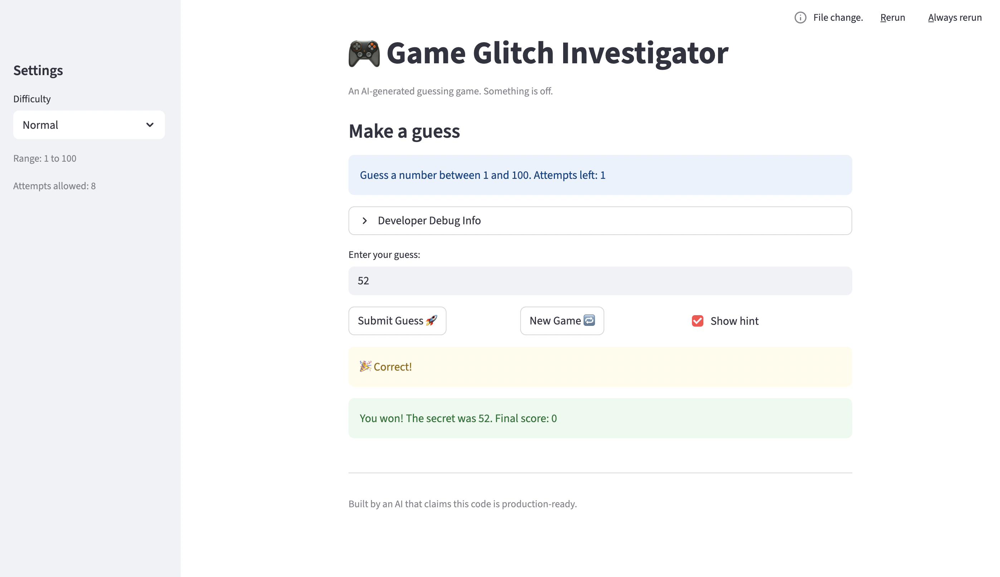

# 🎮 Game Glitch Investigator: The Impossible Guesser

## 🚨 The Situation

You asked an AI to build a simple "Number Guessing Game" using Streamlit.
It wrote the code, ran away, and now the game is unplayable. 

- You can't win.
- The hints lie to you.
- The secret number seems to have commitment issues.

## 🛠️ Setup

1. Install dependencies: `pip install -r requirements.txt`
2. Run the broken app: `python -m streamlit run app.py`

## 🕵️‍♂️ Your Mission

1. **Play the game.** Open the "Developer Debug Info" tab in the app to see the secret number. Try to win.
2. **Find the State Bug.** Why does the secret number change every time you click "Submit"? Ask ChatGPT: *"How do I keep a variable from resetting in Streamlit when I click a button?"*
3. **Fix the Logic.** The hints ("Higher/Lower") are wrong. Fix them.
4. **Refactor & Test.** - Move the logic into `logic_utils.py`.
   - Run `pytest` in your terminal.
   - Keep fixing until all tests pass!

## 📝 Document Your Experience

- [x] **Describe the game's purpose:** A number guessing game where the player guesses a "secret number" while maximizing their score. Developers learn how to separate game logic from UI, verify fixes with pytest, and collaborate with AI tools effectively.
      
   - Actually a buggy application in Streamlit that serves as a code review exercise. The project demonstrates how *test-driven development* and careful refactoring can transform unmaintainable code into a working, testable system. 
- [x] **Detail which bugs you found:** Hints inverted, incorrect conditional logic (as logic/UI mixing), type mismatch on even attempts
- [x] **Explain what fixes you applied:** Comparison logic corrections, type conversions removed, refactored to logic_utils.py

## 📸 Demo

<!-- ## 🚀 Stretch Features

- [ ] [If you choose to complete Challenge 4, insert a screenshot of your Enhanced Game UI here] -->
